<p align="center">
  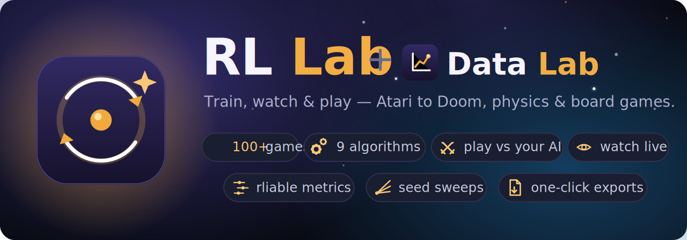
</p>

<h1 align="center">RL Lab</h1>

<p align="center">
  <b>Build, train, watch, and play against reinforcement-learning agents across 100+ environments — from one browser dashboard.</b>
</p>

<p align="center">
  Pick a game, tune the knobs with beginner-friendly info popups, train with one of 9 algorithms,
  watch the agent learn in real time, compare runs like a research paper, then <i>play against your own AI</i>
  with a skill meter. Bilingual&nbsp;(CZ/EN), dark&nbsp;/&nbsp;light.
</p>

<p align="center">
  
  
  
  
  
  
  <br>
  
  
  
  
  
  
</p>

---

## Trained agents, live

Every clip below is a real policy trained inside RL Lab, replayed from a saved checkpoint — a neuroevolution
lander, SAC/PPO MuJoCo robots, a PPO race car, a cooperative multi-agent swarm, Atari from pixels, a Doom
agent fighting from the first-person view, and an AlphaZero board player. The badge on each shows the algorithm and the skill score that run reached.

<table>
  <tr>
    <td align="center">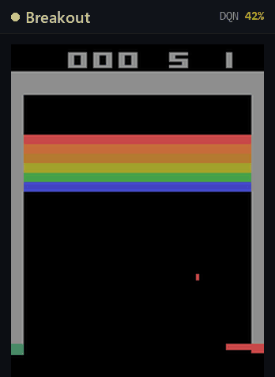</td>
    <td align="center">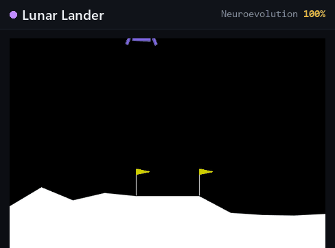</td>
    <td align="center">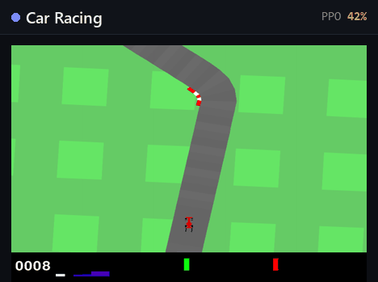</td>
  </tr>
  <tr>
    <td align="center">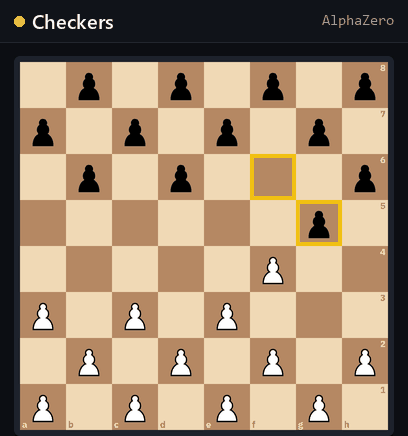</td>
    <td align="center">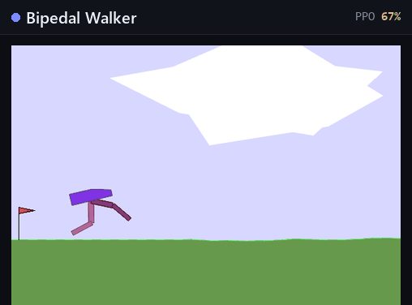</td>
    <td align="center">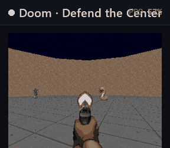</td>
  </tr>
  <tr>
    <td align="center">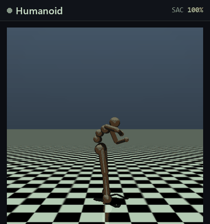</td>
    <td align="center">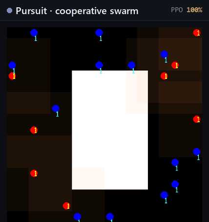</td>
    <td align="center">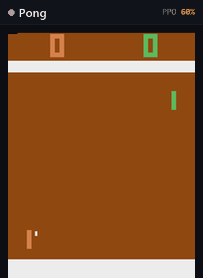</td>
  </tr>
</table>

---

## The dashboard

One screen does it all: choose an environment, set hyperparameters, and press **Run**. The reward curve climbs
live, the agent renders next to it (decoupled from training, so watching never perturbs the run), and a skill
meter reads out where the agent sits between "idle" and "solved."

<p align="center">
  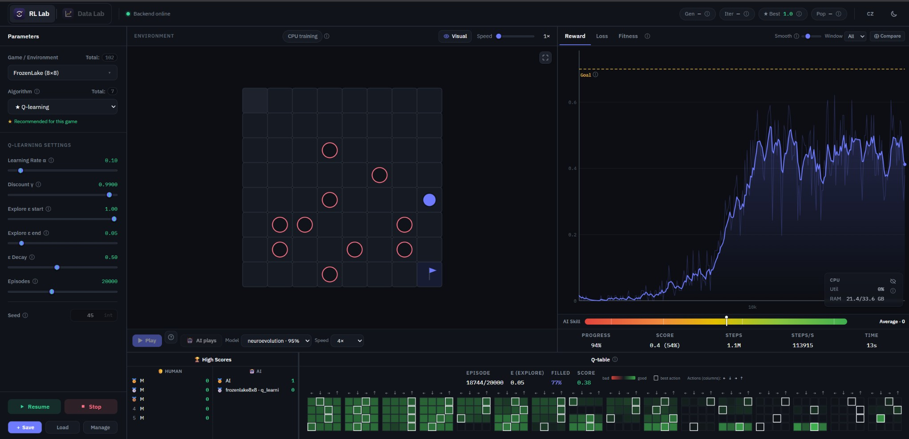
</p>

<p align="center"><i>A Q-learning run on FrozenLake 8×8, mid-training — the reward curve climbing toward the goal, the decoupled grid preview, the live Q-table heatmap, CPU telemetry, and a skill meter.</i></p>

### Dark &amp; light, both first-class

Every surface uses a semantic design system (the "Laboratory" theme) so dark and light both look intentional —
tabular numerics in a monospaced face, 2px dividers between panels, 1px inside. Below, the **same tabular
Q-learning run on Taxi** learning in real time — the reward curve climbing from ≈ −800 toward the goal, the taxi
navigating the grid, the skill meter rising from *Child* to *Superhuman*, and the Q-table heatmap filling in.

<table>
  <tr>
    <td align="center">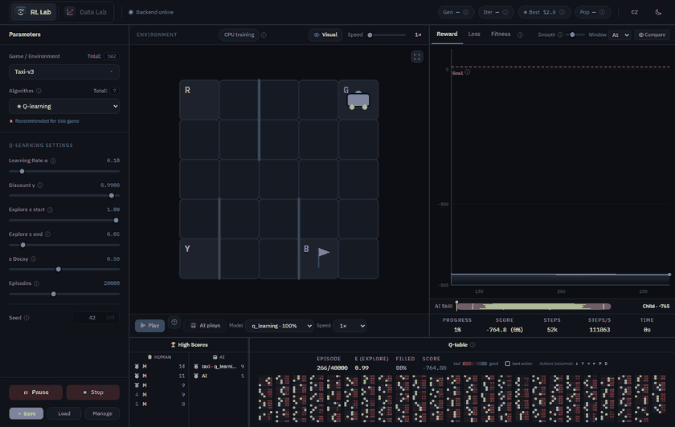<br><b>Dark</b></td>
    <td align="center">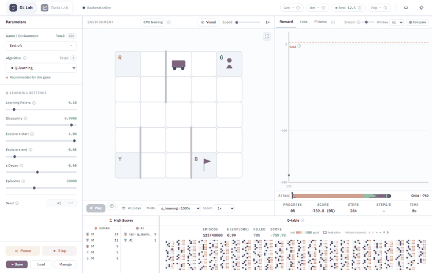<br><b>Light</b></td>
  </tr>
</table>

---

## Features

| Capability | What you get |
| :-- | :-- |
| 🎮 **100+ environments** | Nine families — Classic Control → Toy Text → MiniGrid → Box2D → Atari → MuJoCo → board games → multi-agent → Doom — all behind one data-driven registry. |
| 🧠 **9 algorithms** | PPO · neuroevolution · tabular Q-learning · AlphaZero · SAC · TD3 · DQN · A2C · QR-DQN, gated per-environment with a ★ recommended pick for each game. |
| 📈 **Live training** | Realtime reward / loss / fitness charts with EMA smoothing, a "solved @" marker, and a multi-run compare overlay. |
| 👀 **Watch it learn** | The running policy renders live — client-side SVG for vector envs, server-streamed frames for pixels / MuJoCo — with visual on/off and time-acceleration. |
| 🕹️ **Play vs your AI** | Take control over WebSocket and go head-to-head with the trained agent; a skill meter grades you Child → Below avg → Average → Above avg → Superhuman, with named leaderboards. |
| 🔬 **Data Lab** | A full experiment-analysis surface: seed sweeps, rliable-style aggregation (IQM, bootstrap CIs, performance profiles) reimplemented in-repo, a ranked summary table, and one-click export to CSV / Excel / LaTeX / TensorBoard / repro-card. |
| 💾 **Save / resume / export** | A filterable checkpoint manager — resume training from any snapshot (extending or retuning its config), or export one as a self-contained zip: the model plus the exact config that produced it. |
| 📚 **Learn as you go** | Every tunable ships a bilingual info popup (what it is, ★ recommended value, range, and a note for *this* game). |
| 🌍 **Bilingual &amp; themed** | CZ / EN and dark / light toggles, persisted; accessibility (aria-labels) enforced by a checker. |
| 🔁 **Reproducible** | Every run records its full config + seed; "reproduce this run" is a `curl` command in the repro card. |

---

## Environments

**100+ environments across nine families.** The registry
([`backend/app/envs/registry.py`](backend/app/envs/registry.py)) is the single source of truth — an `EnvSpec`
row does most of the work, so most new games are a data-only addition.

<p align="center">
  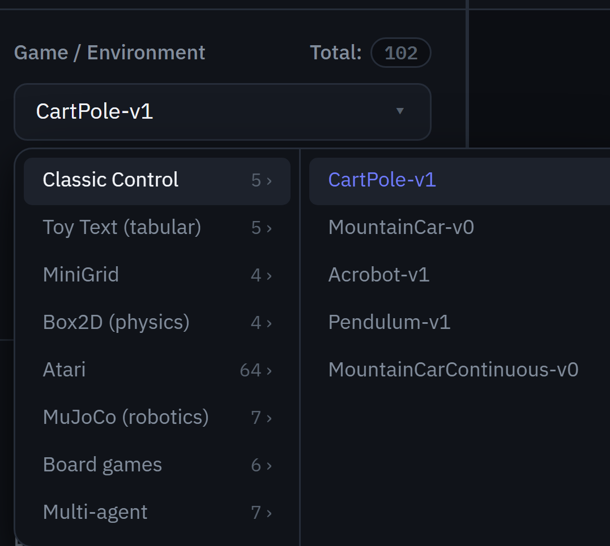
</p>

| Family | Count | Examples | Notes |
|---|:--:|---|---|
| **Classic Control** | 5 | CartPole, MountainCar, Acrobot, Pendulum | vector obs, discrete + continuous actions |
| **Toy Text** | 5 | FrozenLake, Taxi, CliffWalking | discrete obs → tabular Q-learning + PPO / evo |
| **MiniGrid** | 4 | Empty, DoorKey, KeyCorridor, FourRooms | `Dict` obs flattened per family; turn-based |
| **Box2D** | 4 | LunarLander, BipedalWalker, CarRacing | continuous control; CarRacing is image + box |
| **Atari** | 64 | Pong, Breakout, Ms. Pac-Man, Enduro … | image obs → CNN policy on CUDA |
| **MuJoCo** | 7 | Hopper, Walker2d, HalfCheetah, Ant, Humanoid … | continuous torques; SAC is the ★ pick |
| **Board games** | 6 | Tic-Tac-Toe, Connect Four, Othello, Breakthrough, Checkers, Chess | OpenSpiel; MaskablePPO vs an MCTS teacher, or AlphaZero by pure self-play |
| **Multi-agent** | 7 | simple_spread, simple_tag, Pursuit, Multiwalker, Waterworld | PettingZoo + SuperSuit param-sharing / self-play |
| **Doom** | 7 | Basic, Defend the Center, Defend the Line, Health Gathering, Take Cover, Predict Position | 3D FPS from pixels (ViZDoom) → CNN policy on CUDA |

See [`docs/adding-an-environment.md`](docs/adding-an-environment.md) and the
[extensibility seams](docs/architecture.md#the-extensibility-seams).

---

## Algorithms

Every algorithm plugs into one training manager behind a single peer-trainer seam. Each game
declares which algorithms it supports, and which one is ★ recommended.

| Algorithm | Kind | Best for | Notes |
| :-- | :-- | :-- | :-- |
| **PPO** | on-policy policy-gradient | almost everything | Stable-Baselines3; the universal baseline |
| **Neuroevolution** | evolutionary | small vector envs | custom numpy; no gradients, population-based |
| **Q-learning** | tabular value-based | discrete Toy Text | numpy; ships a `<canvas>` Q-table heatmap |
| **AlphaZero** | self-play + MCTS | board games | reimplemented in-repo — no teacher, no human data; scored vs a reference MCTS |
| **SAC** | off-policy actor-critic | continuous control (MuJoCo) | the ★ pick for robotics |
| **TD3** | off-policy deterministic | continuous control | twin critics + delayed updates |
| **DQN** | off-policy value-based | discrete + Atari | ε-greedy; the original deep-RL Atari algorithm (Mnih et al., 2015) |
| **A2C** | on-policy actor-critic | discrete + continuous | PPO's simpler predecessor — one un-clipped update per rollout |
| **QR-DQN** | distributional value-based | discrete + Atari | DQN that learns each action's whole return distribution (quantiles); a Rainbow ingredient |

New algorithms follow [`docs/adding-an-algorithm.md`](docs/adding-an-algorithm.md).

---

## Data Lab

Training gives you curves; the **Data Lab** gives you *conclusions*. Select any runs on disk and it overlays
their learning curves, collapses multiple seeds into a mean ± CI band, and — crucially — lets you **compare
algorithms head-to-head**. It computes the robust metrics a modern RL paper reports — IQM, mean, median,
optimality gap (all with 95% stratified-bootstrap CIs), plus performance profiles and probability-of-improvement.
These are the [rliable](https://github.com/google-research/rliable) estimators (Agarwal et al., NeurIPS 2021),
reimplemented here in pure numpy/scipy rather than taken as a dependency — small, well-specified maths, unit-tested,
with a seeded bootstrap so every confidence interval is reproducible.
A ranked summary table sorts by AUC / final-% / time-to-solve, and one click exports the selection as CSV, Excel
(with native charts), a LaTeX booktabs table, a TensorBoard log dir, a standalone SVG figure, or a
reproducibility card with a config hash + BibTeX.

<p align="center">
  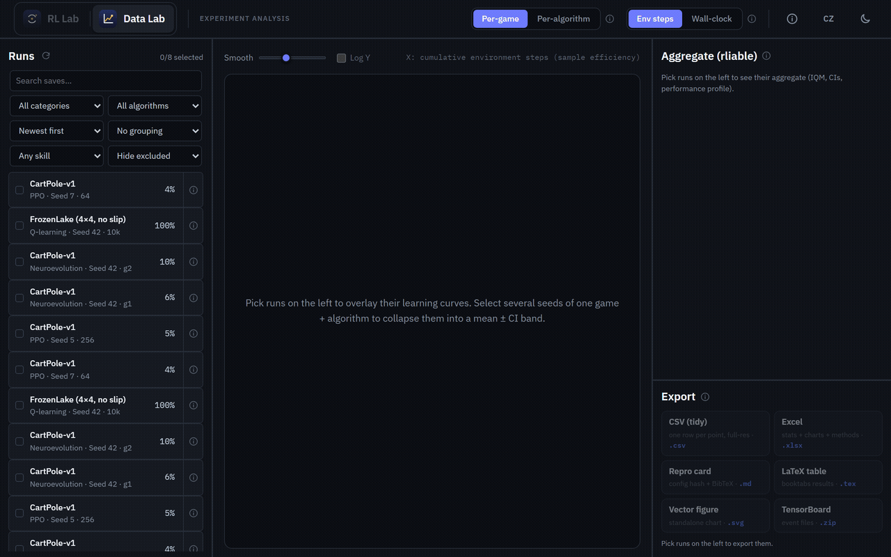
</p>

<p align="center"><i>Building a comparison live: pick runs on the left and the Data Lab overlays their curves, collapses seeds into a mean ± CI band, and recomputes the full rliable-style aggregate, performance profile, and ranked table on the fly — here <b>PPO</b> vs <b>Neuroevolution</b> on CartPole. Wide bands on few seeds are shown honestly; that width <b>is</b> the message.</i></p>

> See [`docs/reproducibility.md`](docs/reproducibility.md) for how runs are recorded and reproduced.

---

## Learn as you go

RL Lab is built to be *understood*, not just run. Every parameter has a data-driven popup — general explanation,
a ★ recommended value, the sane range, and a note specific to the game you're on — in both Czech and English.

<p align="center">
  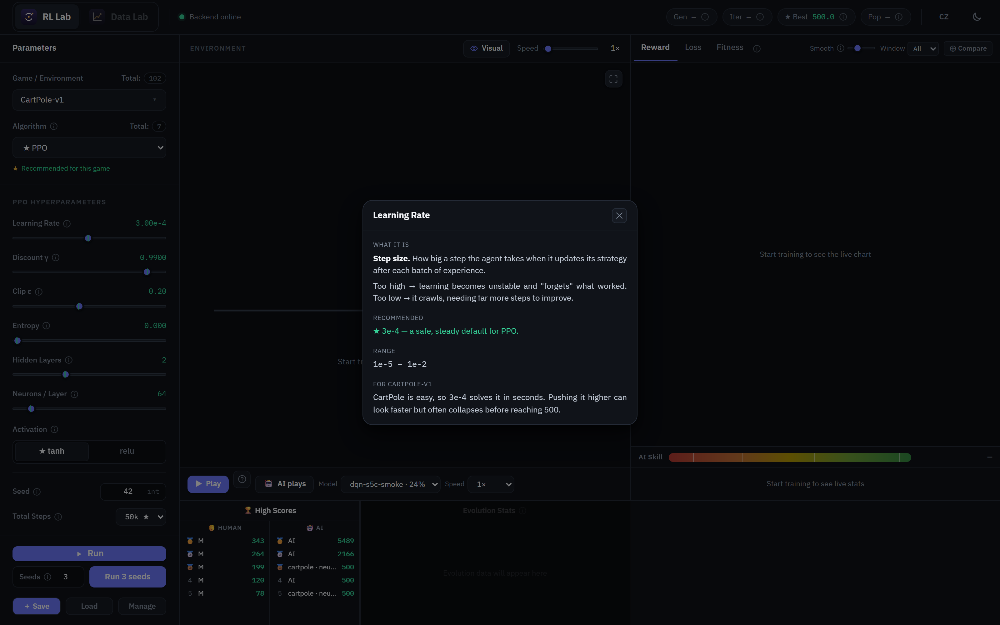
</p>

---

## Board games &amp; self-play

Board games route through OpenSpiel and train two different ways. **MaskablePPO** learns by playing a
Monte-Carlo-Tree-Search teacher whose strength you can dial. **AlphaZero** takes no teacher and no human data at
all — a policy+value CNN guides the search, and the search's own visit counts train the net back. Both are scored
against the *same* reference MCTS, so the two curves compare head-to-head on one yardstick. Watch two AIs play it
out, or take a side yourself and test your skill against the trained agent.

<p align="center">
  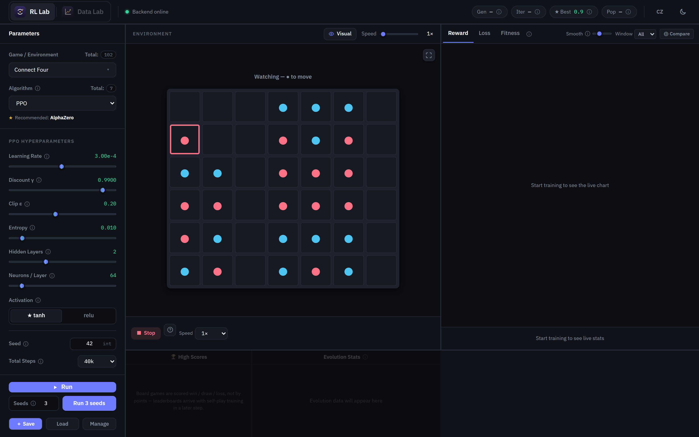
</p>

---

## Tech stack

| Layer | Technology |
|---|---|
| **Backend** | Python 3.11 · FastAPI (REST + WebSocket) · PyTorch · Stable-Baselines3 + `sb3-contrib` (MaskablePPO) · custom numpy neuroevolution + AlphaZero · Gymnasium · MiniGrid · MuJoCo · ViZDoom · OpenSpiel · PettingZoo · SuperSuit · numpy / scipy |
| **Frontend** | React 19 · TypeScript · Vite · Tailwind · zustand · react-i18next · hand-rolled SVG charts |
| **Tooling** | ruff · mypy · pytest (backend) · eslint · vitest (frontend) · an i18n parity checker |

---

## Getting started (dev)

### Prerequisites

- **Python 3.11** — `winget install -e --id Python.Python.3.11` (the system 3.14 is too new for the ML stack)
- **Node 20.19+ or 22.12+** — `winget install OpenJS.NodeJS.LTS` (Vite 8's engine requirement)

### One-time setup

```powershell
py -3.11 -m venv .venv
.\.venv\Scripts\Activate.ps1
python -m pip install --upgrade pip
pip install -r backend/requirements.txt
pip install -r backend/requirements-atari.txt      # optional: enables the 64 Atari envs (GPL ale-py)
pip install ruff mypy pytest                       # dev tools
# GPU: swap the torch wheels to the CUDA 12.8 (Blackwell) index — both, together,
# or a CPU torchvision ends up mismatched against a CUDA torch
pip install torch torchvision --index-url https://download.pytorch.org/whl/cu128
python backend/verify_env.py                       # expects CUDA True + a PPO smoke test
cd frontend; npm install; cd ..
```

### Run it

```powershell
.\tasks.ps1 dev-backend     # FastAPI on http://127.0.0.1:8000  (hot-reload; API docs at /docs)
.\tasks.ps1 dev-frontend    # Vite on http://localhost:5173
```

Then open <http://localhost:5173>, pick an environment, and press **Run**. A standalone single-executable build
is produced by `.\build-standalone.ps1 [-Zip]`.

### Quality gate

```powershell
.\tasks.ps1 lint     # ruff + mypy (backend) + eslint (frontend)
.\tasks.ps1 test     # pytest (backend) + vitest (frontend)
.\tasks.ps1 i18n     # en/cz key parity + every static t('key') resolvable
.\tasks.ps1 build    # tsc + vite production build
.\tasks.ps1 all      # lint + i18n + test + build  ← the one command to run before commit
```

### Environment variables

Copy `backend/.env.example` to `backend/.env` and adjust:

```
HOST=127.0.0.1
PORT=8000
CORS_ORIGINS=http://localhost:5173
```

---

## Documentation

| Doc | What it covers |
|---|---|
| [`docs/architecture.md`](docs/architecture.md) | System &amp; data flow, thread model, rendering paths, the five extensibility seams |
| [`docs/adding-an-environment.md`](docs/adding-an-environment.md) | The data-only path + the seams + the pre-delivery checklist |
| [`docs/adding-an-algorithm.md`](docs/adding-an-algorithm.md) | How a trainer plugs into the one manager |
| [`docs/api.md`](docs/api.md) | REST endpoint + WebSocket frame reference |
| [`docs/reproducibility.md`](docs/reproducibility.md) | Seeds, recorded config, the run archive, "reproduce this run" |

---

## Project structure

```
RL/
├── backend/
│   ├── app/
│   │   ├── api/          # REST routers (/api/*) + WS routing in main.py
│   │   ├── core/         # config, logging, path resolution
│   │   ├── envs/         # environment registry (the source of truth) + factory
│   │   ├── schemas/      # pydantic models = the contracts (mirrored in frontend types.ts)
│   │   ├── services/     # trainers, streamers, stores, training manager, Data Lab analysis
│   │   └── training/     # training utilities
│   ├── tests/
│   └── verify_env.py
├── frontend/
│   └── src/{components, api, store, i18n, content}
├── docs/                 # public docs (architecture, guides, API) + media
├── data/                 # models + checkpoints + runs (gitignored)
├── tools/                # dev utilities (headless screenshot capture)
├── tasks.ps1             # dev shortcuts
└── build-standalone.ps1  # single-executable build
```

---

## Hardware

Developed and trained on a single desktop:

- **Intel Ultra 7 265K · RTX 5070 12 GB · 32 GB RAM · Windows 11**
- Torch **`2.11.0+cu128`** (Blackwell `sm_120`). GPU training is live for **every** family — BipedalWalker,
  the MuJoCo robots, Atari, and CarRacing all run on the GPU.

`python backend/verify_env.py` checks for CUDA + the GPU and runs a PPO smoke test. CPU-only machines run all
human-play paths and every CPU-trainable environment identically (only GPU training is gated out).

---

## Acknowledgements

Built on the shoulders of [Gymnasium](https://gymnasium.farama.org/),
[Stable-Baselines3](https://stable-baselines3.readthedocs.io/), [PyTorch](https://pytorch.org/),
[MiniGrid](https://minigrid.farama.org/), [MuJoCo](https://mujoco.org/),
[ViZDoom](https://vizdoom.farama.org/), [OpenSpiel](https://github.com/google-deepmind/open_spiel),
[PettingZoo](https://pettingzoo.farama.org/) + [SuperSuit](https://github.com/Farama-Foundation/SuperSuit),
and the [rliable](https://github.com/google-research/rliable) methodology (Agarwal et al., NeurIPS 2021).

The Doom environments run on ViZDoom, which bundles the ZDoom engine and ships the
[Freedoom](https://freedoom.github.io/) game data (BSD-licensed) — **RL Lab ships no Doom WADs of its own**.

## License

Licensed under the **GNU Affero General Public License v3.0** (AGPL-3.0) — see [`LICENSE`](LICENSE).

© 2026 Martin Svoboda.

The AGPL keeps the project open for everyone (learn, teach, self-host, modify) while requiring that
anyone who runs a modified version as a network service shares their changes back — a strong-copyleft
choice suited to an educational commons. If you need different terms, reach out.

### Atari environments — optional, not distributed

The 64 Atari (ALE) environments require the **optional** [`ale-py`](https://github.com/Farama-Foundation/Arcade-Learning-Environment)
package, which is deliberately **not** a dependency of this project — it is not installed by
`backend/requirements.txt`. To enable Atari, install it yourself:

```powershell
pip install -r backend/requirements-atari.txt   # (or: pip install ale-py)
```

Everything else — 45 environments across Classic Control, Box2D, Toy Text, MiniGrid, MuJoCo, board games,
multi-agent, and Doom — runs with no extra install. **RL&nbsp;Lab ships no Atari ROMs**; `ale-py` supplies its
own under its own terms. This project is not affiliated with or endorsed by Atari or the Farama Foundation.
