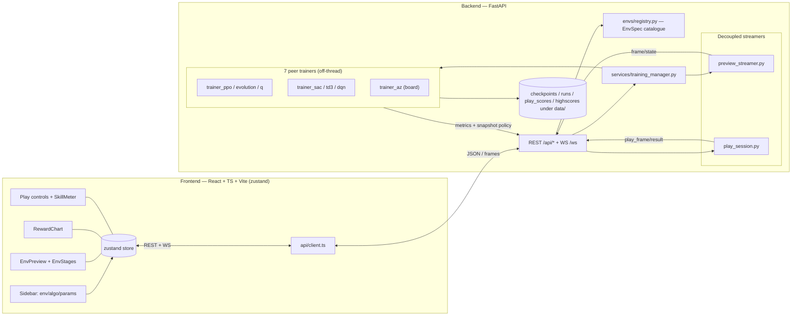

# Architecture

> Living document (seeded in Phase F4). It describes the system as built; update it when a structural
> piece changes. Decision history lives in [`dev_history.md`](../dev_history.md) (ADR-001…NNN).

The **RL All-in-One Dashboard** is a full-stack app to build, train, watch, and play reinforcement-learning
agents across many games. A Python/FastAPI backend runs the ML — **seven peer trainers**: Stable-Baselines3
PPO, off-policy SAC/TD3/DQN, a custom numpy neuroevolution, tabular Q-learning, and an in-repo AlphaZero for
board games, over Gymnasium / PettingZoo / OpenSpiel envs — and streams metrics + rendered state over
WebSocket; a React/TypeScript frontend renders the controls, the live chart, the env preview, and the
play-vs-AI experience.

## High-level shape



## Backend layout (`backend/app/`)

| Area | What it owns |
|---|---|
| `envs/registry.py` | The **`EnvSpec` catalogue** — the single source of truth for every game (spaces, hyperparameter surface, `solved_score`/`min_score`, budget, `supported_algos`, `hw_requirement`, …). Adding a vector/discrete game is a data row here. |
| `services/training_manager.py` | Run lifecycle (start/pause/resume/stop), one active run, routes to the trainer for `config.algo`, owns the `TrainStatus` snapshot. |
| `services/trainer_{ppo,evolution,q,sac,td3,dqn,az}.py` | The **seven peer trainers** (PPO, neuroevolution, Q-learning, SAC, TD3, DQN, AlphaZero — ADR-004/028), each run on a **background thread** so the event loop never blocks. Each publishes a **decoupled, read-only "preview policy"** (a numpy forward or a CPU snapshot) so the live preview never touches the training model. Board + multi-agent add custom trainers (`trainer_board`, `trainer_tag`). |
| `services/preview_streamer.py` | Renders the *live training policy* on its own throwaway env and streams frames (`{type:"frame"}`). Decoupled from training (ADR-008/019). |
| `services/play_session.py` | One interactive episode — human (keyboard over WS) or AI (a loaded checkpoint). Streams `{type:"play_frame"}` + a terminal `{type:"play_result"}` with a skill rating. |
| `services/client_render.py` | For envs the frontend can draw itself, returns the **raw physics state** instead of a JPEG (ADR-018). |
| `services/checkpoints.py` / `runs.py` / `play_scores.py` / `highscores.py` | ML-free JSON/file stores under gitignored `data/`. |
| `services/skill.py` | Turns a finished score into a beginner-friendly **skill band**, derived from the env's `[min_score, solved_score]`. |
| `schemas/` | **pydantic** models = the contract; every WS/REST shape is defined once here and mirrored in `frontend/src/api/types.ts`. |

## Thread model

- **Training runs off the event loop** on a daemon thread (PPO `learn()` / the evolution generation loop).
- A **~1 Hz progress ticker** (PPO) emits live stats independent of SB3's per-step callback.
- The **preview** and **play** streamers are their own threads with their own envs — they never share the
  training env or model. The trainer hands the preview a *snapshot* policy (a numpy forward over copied
  weights for PPO, the generation's leader for evolution). Concurrent `model.predict` on the live SB3 model
  measurably perturbs PPO's trajectory (ADR-019), so this decoupling is load-bearing, not cosmetic.
- Worker threads reach the asyncio loop via `run_coroutine_threadsafe` to broadcast WS frames.

## Rendering: client-side vs server image (ADR-018)

Two paths, chosen per env:

- **Client render** (lighter + crisper): the streamer sends the raw state (`{type:"frame"/"play_frame",
  state:[…], action?, terrain?}`) via `client_render.client_state` — plus, for scene geometry the obs
  can't carry, `client_render.terrain` (e.g. LunarLander's randomly-generated moon surface, projected into
  the lander's own obs-normalized coordinates so the craft and ground share one space and the feet rest on
  the surface). The frontend draws an SVG "stage" and updates the moving parts **imperatively** from each
  frame (no React re-render per frame). Stages live in `frontend/src/components/EnvStages.tsx`, geometry in
  `envGeometry.ts`, dispatch in `EnvPreview.tsx` (`clientKind`). Today: CartPole, MountainCar(+Continuous),
  Pendulum, Acrobot, LunarLander, and the Toy Text **grid-worlds** (FrozenLake / Taxi / CliffWalking) — these
  add a `grid` frame field (`client_render.grid_layout` → a static `GridLayout` board) drawn declaratively by
  a `GridStage`, with `client_state` carrying the agent's cell; the human plays them **turn-based**.
- **Server image**: the streamer renders `rgb_array` → JPEG (`{… image, width, height}`) and the frontend
  draws it to a `<canvas>`. The fallback for any env not in the client-render set (e.g. image-obs envs).

The backend env set (`client_state`) and the frontend `clientKind` must stay in sync.

## Contracts in one place

Every WS frame and REST body is a **pydantic model** in `backend/app/schemas/` and a matching **TS type** in
`frontend/src/api/types.ts`. The WS stream is a tagged union on `type` (`metrics`, `progress`, `hwstats`,
`evolution`, `ma_metrics`, `q_learning`, `qtable`, `highscore`, `status`, `frame`, `preview`, `play_status`,
`play_frame`, `play_result`, plus the inbound `{type:"action"}`). `hwstats` (G4b) is a 1 Hz hardware-telemetry sample
broadcast by the training manager for *any* active run, so the CPU/GPU panel works for every algorithm.

## The extensibility seams

Adding a *vector-obs + discrete-action* game is data-only (a registry row + content). Beyond that, a set of
typed seams need real code — see [`adding-an-environment.md`](adding-an-environment.md) and `CLAUDE.md`:

1. **Policy/device** — `trainer_ppo._build_model` (image obs → `CnnPolicy`+CUDA vs `MlpPolicy`+CPU). **Landed
   for Atari in G4b / ADR-044**; the image preview policy is an SB3 `save`/`load` CPU snapshot (ADR-019 holds).
2. **Shared image path** — one dispatcher `app/envs/image_vec.make_image_vec` routes an image-obs env by family to
   its vec builder, feeding the trainer (`n_envs=8`) *and* the preview/AI-play (`n_envs=1`) so obs/action shapes
   match: `atari.make_atari` (`AtariWrapper`+frame-stack, **G4b**), `make_carracing` (raw-RGB+frame-stack+box,
   G3c-train), and `make_vizdoom` (**a 3rd builder, G8b / ADR-097** — the Gymnasium VizDoom wrapper emits a `Dict`
   obs, so a screen-extraction wrapper `Dict→screen Box` runs before a WarpFrame 84×84 + frame-stack; `SubprocVecEnv`
   like CarRacing, **not** `AtariWrapper`). A new image family = a builder + a `make_image_vec` branch; every trainer
   (PPO/DQN/QR-DQN), the preview and AI-play dispatch through it unchanged.
3. **Action space** — discrete `int` vs continuous `box` (done for classic-control + multi-joint; CarRacing image-box *human* play landed; **Atari image AI-play landed in G4c / ADR-046** via `play_session._run_image_ai` over the `make_atari` vec env); image-box *training* is G3c-train.
4. **Competitive play** — a `side` selector + a 2-agent env (Pong).
5. **Board games** (OpenSpiel, **foundation G6a / ADR-050; neural trainer G6b / ADR-051**) — a 2-player,
   turn-based, perfect-info, zero-sum game with legal-move masking + self-play is `pyspiel.State`, not a
   `gym.Env`, so a board row (`family="board"`) is a discoverable picker entry **routed via `is_board_game` to
   `app/services/board_engine.py`** (the parallel to `is_multi_agent`), never through `make_env`. The built-in
   opponent is a **training-free MCTS**. **G6b made it trainable** (`train_implemented=True`):
   `services/trainer_board.py` is a `sb3-contrib` **MaskablePPO** (action mask from `legal_actions()`) that learns
   by playing the MCTS *teacher* (a risk-gate found pure self-play too slow on a CPU budget; vs-MCTS draws TTT in
   ~80–100k steps). The manager routes board+ppo → `train_board` via `is_board_game` (still `algo=="ppo"`, the
   `trainer_tag` custom-trainer shape). A game-agnostic `BoardSelfPlayEnv` (single-agent gym view, randomised seat,
   `action_masks()`) + an ADR-019-safe masked CPU snapshot + `eval_vs_mcts` are the glue; the honest learning curve
   is **eval-vs-reference-MCTS ∈ [−1,1]** reported as `ep_rew_mean` on the existing `metrics` + `progress` frames
   (the Reward tab reads `progressHistory`). The decoupled preview self-plays the learning net on the board
   (additive `board` on the preview `FrameMessage`; `BoardState` lives in `schemas/preview` to ride both a
   `play_frame` and a preview `frame`). Board play **reuses the play lane** (`play_session._run_board`): human-vs-MCTS,
   **human-vs-your-trained-net** (a board `checkpoint_id` → `board_engine.load_board_predict`), or an AI-vs-AI watch
   (MCTS or net); the contract grows additively (`side`/`ai_strength`/`checkpoint_id` on `PlayConfig`, `outcome` +
   optional `rating` on `PlayResult`). The board is client-rendered (`clientKind="board"`, `BoardStage`); only the
   renderer's glyph map (`content/boardGames.ts`) + the one catalog row are game-specific — engine/session/trainer/
   contract are game-agnostic (a `connect_four` test drives the same functions). The 3-valued win/draw/loss outcome
   replaces the continuous skill meter with an honest W/D/L banner (which names the opponent — the MCTS difficulty or
   "your trained AI"); the play leaderboard is deferred. **Ships Tic-Tac-Toe; further games (Connect Four → chess/go)
   are data + a renderer glyph map.**
6. **Multi-agent** (PettingZoo, **landed G7a / ADR-038**) — N agents in one shared world (the parallel API),
   so *not* the single-agent `make_env` factory. A dedicated adapter (`app/services/ma_env.py`) builds the
   raw parallel env (preview/render) and the SuperSuit parameter-sharing **vec env** (one shared `MlpPolicy`
   over all homogeneous agents); `trainer_ppo` + the preview streamer branch on `family=="petting_zoo"`. The
   `frame` WS type carries additive `agents`/`world` positions for a client-rendered "swarm" canvas. Homogeneous
   agents train via parameter sharing (simple_spread). **Heterogeneous species (simple_tag predators vs. prey)
   are registered *watch-only* (G7b-1 / ADR-047):** different obs sizes + opposite rewards break parameter
   sharing, so their per-species trainer is deferred (`train_implemented=False`) and the env is made watchable
   without training via `POST /api/preview/watch` (the streamer runs a no-policy random rollout). The per-species
   trainer (G7b-2) and 2-agent competitive play (G7b/c) come later.

## Standalone packaging (F5)

The app can be built into a **one-folder Windows executable** (no Python needed on the target machine):

```
build-standalone.ps1 -Zip          # npm run build → PyInstaller → dist\RL-Dashboard.zip
dist\RL-Dashboard\RL-Dashboard.exe  # double-click to run
```

**Single-process design:** `backend/launcher.py` is the entry point. It picks a free port, launches
uvicorn, opens the browser once the server is up, and runs in the foreground. FastAPI mounts the built
SPA (`frontend/dist`, bundled as `frontend_dist` under `sys._MEIPASS`) at `/` *after* all `/api/*` and
`/ws` routes, so the same process serves UI + API + WebSocket on one origin — the frontend needs no
configuration change.

**Path resolution (`app/core/paths.py`):** `is_frozen()` detects the bundle; `data_dir()` redirects
writable state to `%LOCALAPPDATA%\RLDashboard\data` (vs repo-root `data/` in dev); `frontend_dist_dir()`
finds the bundled SPA under `sys._MEIPASS`. Overridable via `RL_DASHBOARD_DATA_DIR` for portable/test use.

**CPU edition:** GPU games are absent on hardware without CUDA via the registry's `hw_requirement` + 
`torch.cuda.is_available()` — no crash, just the CPU catalogue. See `rl_dashboard.spec` + `Local/standalone-build.md` for build notes and the clean-machine test checklist.

## Related documentation

- [`adding-an-environment.md`](adding-an-environment.md) — the data-only path + the six seams.
- [`adding-an-algorithm.md`](adding-an-algorithm.md) — the peer-trainer contract.
- [`api.md`](api.md) — REST endpoints + the WebSocket frame union.
- [`reproducibility.md`](reproducibility.md) — seeds, recorded config, the run archive.
- [`adr.md`](adr.md) — the architecture-decision index (full text in [`dev_history.md`](../dev_history.md)).
