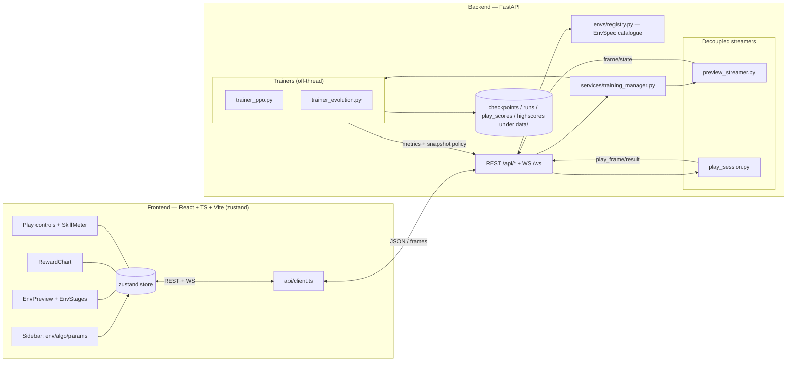

# Architecture

> Living document (seeded in Phase F4). It describes the system as built; update it when a structural
> piece changes. Decision history lives in [`dev_history.md`](../dev_history.md) (ADR-001…NNN).

The **RL All-in-One Dashboard** is a full-stack app to build, train, watch, and play reinforcement-learning
agents across many games. A Python/FastAPI backend runs the ML (Stable-Baselines3 PPO, a custom numpy
neuroevolution, Gymnasium envs) and streams metrics + rendered state over WebSocket; a React/TypeScript
frontend renders the controls, the live chart, the env preview, and the play-vs-AI experience.

## High-level shape

## Backend layout (`backend/app/`)

| Area | What it owns |
|---|---|
| `envs/registry.py` | The **`EnvSpec` catalogue** — the single source of truth for every game (spaces, hyperparameter surface, `solved_score`/`min_score`, budget, `supported_algos`, `hw_requirement`, …). Adding a vector/discrete game is a data row here. |
| `services/training_manager.py` | Run lifecycle (start/pause/resume/stop), one active run, routes to the trainer for `config.algo`, owns the `TrainStatus` snapshot. |
| `services/trainer_ppo.py` / `trainer_evolution.py` | The two learning methods, run on a **background thread** so the event loop never blocks. Each publishes a **decoupled, read-only "preview policy"** (a numpy forward) so the live preview never touches the training model. |
| `services/preview_streamer.py` | Renders the *live training policy* on its own throwaway env and streams frames (`{type:"frame"}`). Decoupled from training (ADR-008/019). |
| `services/play_session.py` | One interactive episode — human (keyboard over WS) or AI (a loaded checkpoint). Streams `{type:"play_frame"}` + a terminal `{type:"play_result"}` with a skill rating. |
| `services/client_render.py` | For envs the frontend can draw itself, returns the **raw physics state** instead of a JPEG (ADR-018). |
| `services/checkpoints.py` / `runs.py` / `play_scores.py` / `highscores.py` | ML-free JSON/file stores under gitignored `data/`. |
| `services/skill.py` | Turns a finished score into a beginner-friendly **skill band**, derived from the env's `[min_score, solved_score]`. |
| `schemas/` | **pydantic** models = the contract; every WS/REST shape is defined once here and mirrored in `frontend/src/api/types.ts`. |

## Thread model

- **Training runs off the event loop** on a daemon thread (PPO `learn()` / the evolution generation loop).
- A **~1 Hz progress ticker** (PPO) emits live stats independent of SB3's per-step callback.
- The **preview** and **play** streamers are their own threads with their own envs — they never share the
  training env or model. The trainer hands the preview a *snapshot* policy (a numpy forward over copied
  weights for PPO, the generation's leader for evolution). Concurrent `model.predict` on the live SB3 model
  measurably perturbs PPO's trajectory (ADR-019), so this decoupling is load-bearing, not cosmetic.
- Worker threads reach the asyncio loop via `run_coroutine_threadsafe` to broadcast WS frames.

## Rendering: client-side vs server image (ADR-018)

Two paths, chosen per env:

- **Client render** (lighter + crisper): the streamer sends the raw state (`{type:"frame"/"play_frame",
  state:[…], action?, terrain?}`) via `client_render.client_state` — plus, for scene geometry the obs
  can't carry, `client_render.terrain` (e.g. LunarLander's randomly-generated moon surface, projected into
  the lander's own obs-normalized coordinates so the craft and ground share one space and the feet rest on
  the surface). The frontend draws an SVG "stage" and updates the moving parts **imperatively** from each
  frame (no React re-render per frame). Stages live in `frontend/src/components/EnvStages.tsx`, geometry in
  `envGeometry.ts`, dispatch in `EnvPreview.tsx` (`clientKind`). Today: CartPole, MountainCar(+Continuous),
  Pendulum, Acrobot, LunarLander, and the Toy Text **grid-worlds** (FrozenLake / Taxi / CliffWalking) — these
  add a `grid` frame field (`client_render.grid_layout` → a static `GridLayout` board) drawn declaratively by
  a `GridStage`, with `client_state` carrying the agent's cell; the human plays them **turn-based**.
- **Server image**: the streamer renders `rgb_array` → JPEG (`{… image, width, height}`) and the frontend
  draws it to a `<canvas>`. The fallback for any env not in the client-render set (e.g. image-obs envs).

The backend env set (`client_state`) and the frontend `clientKind` must stay in sync.

## Contracts in one place

Every WS frame and REST body is a **pydantic model** in `backend/app/schemas/` and a matching **TS type** in
`frontend/src/api/types.ts`. The WS stream is a tagged union on `type` (`metrics`, `progress`, `evolution`,
`status`, `frame`, `preview`, `play_status`, `play_frame`, `play_result`, plus the inbound `{type:"action"}`).

## The five extensibility seams

Adding a *vector-obs + discrete-action* game is data-only (a registry row + content). Beyond that, five
typed seams need real code — see [`adding-an-environment.md`](adding-an-environment.md) and `CLAUDE.md`:

1. **Policy/device** — `trainer_ppo._build_model` (image obs → `CnnPolicy`+CUDA vs `MlpPolicy`+CPU).
2. **Shared Atari path** — frame-stack/vec-env used by the trainer *and* both streamers.
3. **Action space** — discrete `int` vs continuous `box` (done for classic-control continuous; image-box next).
4. **Competitive play** — a `side` selector + a 2-agent env (Pong).
5. **Board games** — a parallel turn-based/self-play subsystem (OpenSpiel), not a registry row.

## Related documentation

- [`adding-an-environment.md`](adding-an-environment.md) — the data-only path + the five seams.
- [`adding-an-algorithm.md`](adding-an-algorithm.md) — the peer-trainer contract.
- [`api.md`](api.md) — REST endpoints + the WebSocket frame union.
- [`reproducibility.md`](reproducibility.md) — seeds, recorded config, the run archive.
- [`adr.md`](adr.md) — the architecture-decision index (full text in [`dev_history.md`](../dev_history.md)).
